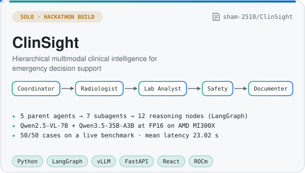
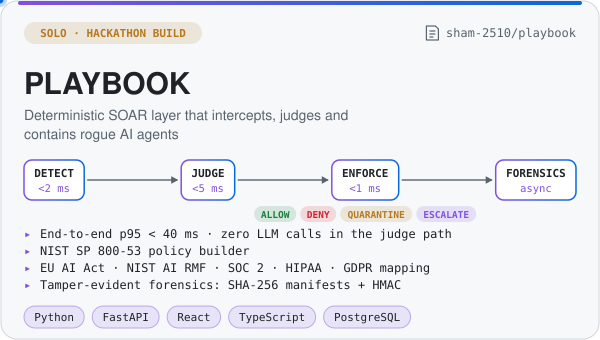

<div align="center">

<picture>
  <source media="(prefers-color-scheme: dark)" srcset="assets/hero-dark.svg">
  <source media="(prefers-color-scheme: light)" srcset="assets/hero-light.svg">
  
</picture>

<picture>
  <source media="(prefers-color-scheme: dark)" srcset="assets/typing-dark.svg">
  <source media="(prefers-color-scheme: light)" srcset="assets/typing-light.svg">
  
</picture>

<br>

<a href="https://www.linkedin.com/in/shamuddin-n-b90018160/"></a>
<a href="mailto:shamuddin1011@gmail.com"></a>
<a href="#open-to"></a>

</div>

## whoami

<picture>
  <source media="(prefers-color-scheme: dark)" srcset="assets/whoami-dark.svg">
  <source media="(prefers-color-scheme: light)" srcset="assets/whoami-light.svg">
  
</picture>

AI/ML Architect & Consultant with **6+ years** building production AI and cloud platforms, mostly in **healthcare SaaS** (HIPAA, HL7 FHIR). I design secure .NET and Python services on **Azure, AWS and GCP** and ship LLM, speech and agentic features on top — one ambient clinical scribe cut manual documentation time by **80%**.

I guide teams of 2–4 engineers and turn rough ideas into working proofs of concept fast.

<details>
<summary>Text version</summary>

```yaml
model: shamuddin-n
role: AI/ML Architect & Consultant
experience: 6+ years            # production AI, cloud, healthcare SaaS
architecture:
  core:   [C#, .NET, ASP.NET Core, Python, TypeScript]
  ai:     [Azure OpenAI, Azure AI Speech, LangGraph, vLLM, RAG, AI agents]
  cloud:  [Azure, AWS, GCP]
training_data:
  domains: [Healthcare SaaS, HIPAA, HL7 FHIR R4, Payments, Finance]
eval:
  certifications: [AI-102 (Dec 2025), AI-900 (Aug 2025)]
  education:      [MCA 2024, BCA 2020]
intended_use: [Applied AI, AI Research, Applied Science with AI]
languages: [English (C1, fluent)]
status: online
```

</details>

## Impact & strengths

<picture>
  <source media="(prefers-color-scheme: dark)" srcset="assets/impact-dark.svg">
  <source media="(prefers-color-scheme: light)" srcset="assets/impact-light.svg">
  
</picture>

## Capabilities

What I build, end to end. Healthcare AI is one of five capabilities.

<table>
<tr>
<td width="34%"><b>LLM & agentic systems, RAG</b></td>
<td>Azure OpenAI and Microsoft Foundry deployments, LangGraph multi-agent pipelines, vLLM serving, retrieval-augmented generation, prompt orchestration, deterministic guardrails for agents. Proof: <a href="https://github.com/sham-2510/ClinSight">ClinSight</a>, <a href="https://github.com/sham-2510/playbook">PLAYBOOK</a>.</td>
</tr>
<tr>
<td width="34%"><b>Healthcare AI & interoperability</b></td>
<td>Ambient clinical scribe (Azure AI Speech + Azure OpenAI), sentiment-driven patient-feedback escalation (Azure AI Language), clinical audio transcription with speaker diarization in Python, HIPAA-compliant multi-tenant HL7 FHIR R4 data hub (Azure Functions, Service Bus, Logic Apps).</td>
</tr>
<tr>
<td width="34%"><b>Cloud & platform engineering (Azure · AWS · GCP)</b></td>
<td>Secure multi-tenant ASP.NET Core and Python services; edge security with Front Door WAF, API Management and origin locking; Key Vault, Entra ID, AD B2C; CI/CD with Azure DevOps and GitHub Actions; on-prem Oracle/SQL Server → Azure SQL migration with Data Factory.</td>
</tr>
<tr>
<td width="34%"><b>Secure payments & integrations</b></td>
<td>Multi-tenant payment gateway (100+ TPS peaks), PCI-conscious client-side tokenization, X.509-encrypted results over Service Bus, retry/dead-letter recovery, lab-partner integration APIs with OAuth 2.0/OIDC.</td>
</tr>
<tr>
<td width="34%"><b>AI research & proofs of concept</b></td>
<td>NeRF 3D reconstruction from 2D radiographs (NVIDIA GPUs), AI-assisted CAD engine on Azure AI + Python. Details below.</td>
</tr>
</table>

### Inside the AI clinical scribe

<picture>
  <source media="(prefers-color-scheme: dark)" srcset="assets/arch-scribe-dark.svg">
  <source media="(prefers-color-scheme: light)" srcset="assets/arch-scribe-light.svg">
  
</picture>

<sub>Simplified. Service keys never reach the browser; PHI is encrypted with certificates held in Azure Key Vault; a clinician reviews every note.</sub>

<details>
<summary><b>R&D and proofs of concept</b></summary>

- **NeRF from radiographs (NVIDIA)** — reconstructed 3D models of the hand and leg from 2D radiographic images with Neural Radiance Fields; benchmarked GPU configurations for rendering speed vs. anatomical detail.
- **AI-assisted CAD engine (Azure AI + Python)** — quantity takeoff from vector CAD PDFs: 72 object types and 480 instances recognised on a production A0 drawing, 87 rooms measured, 890 automated tests; Azure AI Document Intelligence OCR at 97% text coverage, Azure OpenAI optional and off by default.

</details>

## Tech stack

<p align="center">
<picture>
  <source media="(prefers-color-scheme: dark)" srcset="https://skillicons.dev/icons?i=cs%2Cdotnet%2Cpy%2Cfastapi%2Cts%2Cjs%2Creact%2Cnextjs%2Cpostgres&amp;perline=14&amp;theme=dark">
  <source media="(prefers-color-scheme: light)" srcset="https://skillicons.dev/icons?i=cs%2Cdotnet%2Cpy%2Cfastapi%2Cts%2Cjs%2Creact%2Cnextjs%2Cpostgres&amp;perline=14&amp;theme=light">
  
</picture>
<br>
<picture>
  <source media="(prefers-color-scheme: dark)" srcset="https://skillicons.dev/icons?i=azure%2Caws%2Cgcp%2Cgithubactions%2Cpowershell&amp;perline=14&amp;theme=dark">
  <source media="(prefers-color-scheme: light)" srcset="https://skillicons.dev/icons?i=azure%2Caws%2Cgcp%2Cgithubactions%2Cpowershell&amp;perline=14&amp;theme=light">
  
</picture>
</p>

<table>
<tr>
<td width="170"><b>AI · LLM · Agents</b></td>
<td>
              
</td>
</tr>
<tr>
<td width="170"><b>Azure</b></td>
<td>
                                
</td>
</tr>
<tr>
<td width="170"><b>AWS</b></td>
<td>
           
</td>
</tr>
<tr>
<td width="170"><b>Google Cloud</b></td>
<td>
       
</td>
</tr>
<tr>
<td width="170"><b>.NET & Backend</b></td>
<td>
         
</td>
</tr>
<tr>
<td width="170"><b>Data</b></td>
<td>
  
</td>
</tr>
<tr>
<td width="170"><b>Frontend</b></td>
<td>
     
</td>
</tr>
<tr>
<td width="170"><b>DevOps & Quality</b></td>
<td>
         
</td>
</tr>
<tr>
<td width="170"><b>Security & Compliance</b></td>
<td>
       
</td>
</tr>
</table>

## Featured work

Two solo hackathon builds that are public. Most of my production and client work lives in private repositories — the telemetry below counts it.

<table>
<tr>
<td width="50%" valign="top">
<a href="https://github.com/sham-2510/ClinSight">
<picture>
  <source media="(prefers-color-scheme: dark)" srcset="assets/cards/clinsight-dark.svg">
  <source media="(prefers-color-scheme: light)" srcset="assets/cards/clinsight-light.svg">
  
</picture>
</a>
</td>
<td width="50%" valign="top">
<a href="https://github.com/sham-2510/playbook">
<picture>
  <source media="(prefers-color-scheme: dark)" srcset="assets/cards/playbook-dark.svg">
  <source media="(prefers-color-scheme: light)" srcset="assets/cards/playbook-light.svg">
  
</picture>
</a>
</td>
</tr>
</table>

## Experience

<picture>
  <source media="(prefers-color-scheme: dark)" srcset="assets/timeline-dark.svg">
  <source media="(prefers-color-scheme: light)" srcset="assets/timeline-light.svg">
  
</picture>

<details>
<summary><b>Text version</b></summary>

**Senior AI Engineer** · 2023 – Present

- Lead and mentor teams of 2–4 engineers through Agile/DevSecOps delivery, partnering with stakeholders to turn client needs into shipped software.
- Built an AI clinical scribe inside a fertility EMR (Azure AI Speech + Azure OpenAI) that cut manual documentation time by 80%.
- Designed a multi-tenant payment gateway handling peaks of 100+ transactions per second; Pub/Sub retry and dead-letter workflows cut payment failures by 40%.
- Architected a HIPAA-compliant, multi-tenant HL7 FHIR R4 data hub with Azure Functions, Service Bus and Logic Apps.
- Secured a public patient-onboarding chatbot with Azure Front Door WAF, API Management and origin locking.

**Full Stack Azure Developer** · 2020 – 2022

- Migrated on-premises Oracle and SQL Server financial systems to Azure SQL with Azure Data Factory ETL pipelines.
- Reduced application load time from ~2 minutes to ~2 seconds.
- Cut manual deployment effort by 70% with PowerShell, Azure CLI and Azure DevOps CI/CD.

**Education** · MCA, 2024 · BCA, 2020

</details>

## Certifications

<table>
<tr>
<td align="center" width="140"><a href="https://learn.microsoft.com/api/credentials/share/en-us/Shamuddin-2510/38E1EAFD8E68B47F?sharingId=78AC01E7BE1C0E0"></a></td>
<td><b>Microsoft Certified: Azure AI Engineer Associate</b> (AI-102)<br>Issued Dec 29, 2025 · <a href="https://learn.microsoft.com/api/credentials/share/en-us/Shamuddin-2510/38E1EAFD8E68B47F?sharingId=78AC01E7BE1C0E0">Verify credential</a></td>
</tr>
<tr>
<td align="center" width="140"><a href="https://learn.microsoft.com/api/credentials/share/en-us/Shamuddin-2510/CC3350857AE51DD1?sharingId=78AC01E7BE1C0E0"></a></td>
<td><b>Microsoft Certified: Azure AI Fundamentals</b> (AI-900)<br>Issued Aug 16, 2025 · <a href="https://learn.microsoft.com/api/credentials/share/en-us/Shamuddin-2510/CC3350857AE51DD1?sharingId=78AC01E7BE1C0E0">Verify credential</a></td>
</tr>
</table>

## GitHub telemetry

Public **and** private work, self-rendered daily by a GitHub Action from GitHub data. Private repositories show up as counts only, never names or code.

<picture>
  <source media="(prefers-color-scheme: dark)" srcset="assets/generated/telemetry-dark.svg">
  <source media="(prefers-color-scheme: light)" srcset="assets/generated/telemetry-light.svg">
  
</picture>

<picture>
  <source media="(prefers-color-scheme: dark)" srcset="assets/generated/neural-activity-dark.svg">
  <source media="(prefers-color-scheme: light)" srcset="assets/generated/neural-activity-light.svg">
  
</picture>

## Open to

**Applied AI · AI Research · Applied Science with AI** — building, researching and shipping AI that works in the real world. Reach me on [LinkedIn](https://www.linkedin.com/in/shamuddin-n-b90018160/) or by [email](mailto:shamuddin1011@gmail.com).

<div align="center">

<picture>
  <source media="(prefers-color-scheme: dark)" srcset="assets/footer-dark.svg">
  <source media="(prefers-color-scheme: light)" srcset="assets/footer-light.svg">
  
</picture>

**Building secure, useful AI. Let's talk.**

[LinkedIn](https://www.linkedin.com/in/shamuddin-n-b90018160/) · [Email](mailto:shamuddin1011@gmail.com) · [GitHub](https://github.com/sham-2510)

</div>
